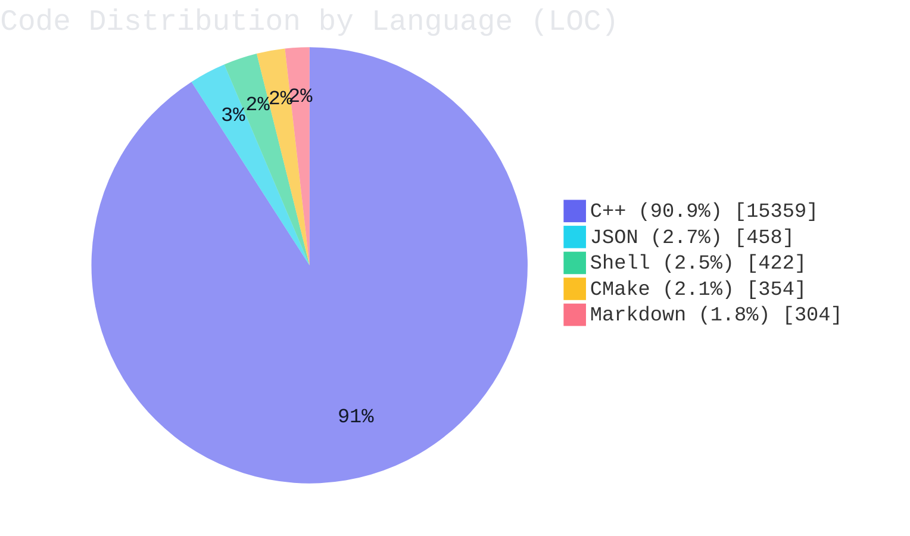

<!-- README_STATS:START -->
## Live Code Statistics

> Last updated: `2026-04-17 10:11:12` (GMT).

| Metric | Value |
| --- | ---: |
| Total code lines | `16,897` |
| Class/Struct definitions (C++) | `126` |
| Function definitions (C++, heuristic) | `550` |
| Stack object declarations (C++, heuristic) | `783` |
| Static variable declarations (C++, heuristic) | `21` |
| Heap allocations via `new` (C++, heuristic) | `0` |
| `make_shared`/`make_unique` calls (C++, heuristic) | `5` |

### Distribution Chart

<!-- README_STATS:END -->
