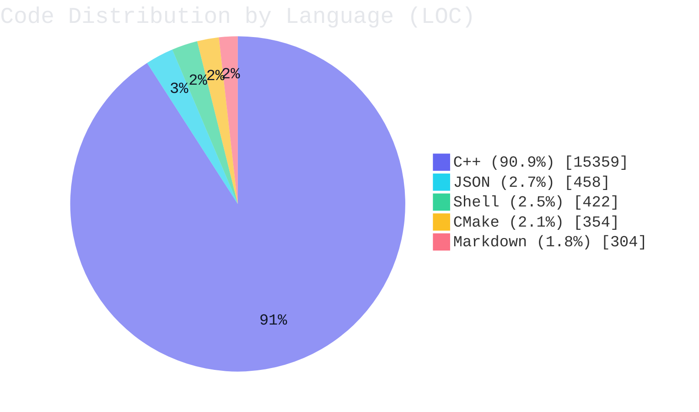

<!-- README_STATS:START -->
## 实时代码统计

> 最后更新时间：`2026-04-17 18:11:12`（UTC+8）。

| 指标 | 数值 |
| --- | ---: |
| 代码总行数 | `16,897` |
| 类/结构体定义数量（C++） | `126` |
| 函数定义数量（C++，启发式） | `550` |
| 栈对象声明数量（C++，启发式） | `783` |
| 静态变量声明数量（C++，启发式） | `21` |
| `new` 堆分配次数（C++，启发式） | `0` |
| `make_shared`/`make_unique` 调用次数（C++，启发式） | `5` |

### 分布图

<!-- README_STATS:END -->
